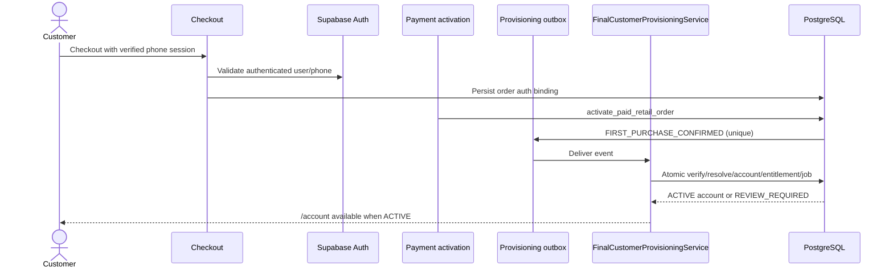
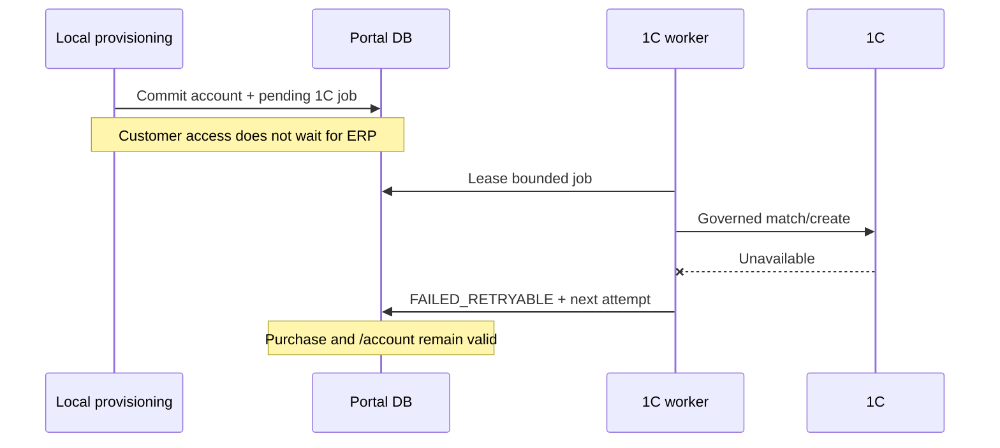

# Final Customer Provisioning

Status: Slice 3 purchase-entitlement cutover and governed asynchronous 1C Final Customer provisioning contract implemented. This document separates authentication, identity correlation, cabinet entitlement, purchase ownership, and asynchronous 1C correlation.

## Permanent access invariant (Slice 3)

For every post-cutover user, OTP success, Supabase Auth user creation, identity correlation, checkout and Retail Order creation are not cabinet entitlement. New Final Customer access is created only by the provider-neutral confirmed-purchase boundary (`FIRST_PURCHASE_CONFIRMED` -> `FinalCustomerProvisioningService` -> `provision_final_customer_from_purchase_v1`). Page rendering, access resolution and `/account` route guards are read-only.

Pre-cutover accounts are preserved by the immutable, one-time seeded `customer_account_legacy_entitlements` cohort. The table has no runtime insert grant, so compatibility cannot grow after cutover. `CUSTOMER_PURCHASE_ENTITLEMENT_ENFORCED=false` is an access-only rollback for an already existing ACTIVE account; it never restores OTP-time account creation.

Legacy compatibility may be retired only after every remaining marker has either immutable purchase entitlement evidence or an explicitly governed closure decision, with zero unresolved identity/security cases and completed real-user acceptance. Deleting or weakening the cohort before those conditions is prohibited.

## Implemented Slice 2 contract

Migration `20260919201121_final_customer_first_purchase_provisioning_v1.sql` implements the approved local boundary:

- authenticated checkout binds the locked order through the service-only `bind_retail_order_authenticated_owner_v1`; the Server Action derives the principal from `auth.getUser()`, and the RPC rechecks that Auth user's confirmed phone against the Retail customer while storing only keyed-HMAC evidence;
- `activate_paid_retail_order` transactionally inserts one provider-neutral `FIRST_PURCHASE_CONFIRMED` outbox fact after the authoritative activation record exists, including on a safe replay that heals a missing event;
- purchases without a verified owner remain in `AWAITING_OWNER`; the bounded worker claims only eligible purchases, using `FOR UPDATE SKIP LOCKED`, expiring leases and retry backoff;
- `provision_final_customer_from_purchase_v1` validates and locks order, activation, binding, identity and account evidence, then creates or reuses the account, links the Retail customer root, writes immutable entitlement/audit evidence and queues the 1C seam atomically;
- existing account uniqueness plus verified-key uniqueness and advisory locks serialize duplicate and concurrent processing;
- `customer_external_provisioning_jobs` is the durable asynchronous 1C seam. No 1C call occurs in checkout, payment activation, provisioning, Auth or cabinet rendering.

The obsolete `getFinalCustomerContext() -> ensureAccount()` create-on-read path has been removed. Setting `NEW_PURCHASE_PROVISIONING_ENABLED=false` still stops worker claims; `CUSTOMER_PURCHASE_ENTITLEMENT_ENFORCED=false` only relaxes access classification for an already existing ACTIVE account.

The implementation now has an approved Final Customer Counterparty match/create provider contract, canonical minimal DTO/write payload, and governed idempotency/reconciliation semantics. Runtime processing is independently gated by `ONE_C_CUSTOMER_PROVISIONING_ENABLED=true`; writes additionally require `ONE_C_CUSTOMER_WRITE_READY=true` and a successful current `$metadata` contract audit. Until both gates are explicitly enabled, jobs remain pending and active local accounts are unaffected.

## Non-negotiable invariant

Phone OTP authentication is not Final Customer provisioning.

`customer_identity` is the canonical, source-neutral correlation root and may exist before a cabinet. `customer_account` is the Final Customer cabinet entitlement and must not be created for a new user until an authoritative first purchase is confirmed.

The permitted lifecycle is:

```text
VISITOR -> SHOPPER -> CHECKOUT -> VERIFIED PHONE BINDING
        -> AUTHORITATIVE PURCHASE CONFIRMATION
        -> FINAL CUSTOMER PROVISIONING
        -> CUSTOMER ACCOUNT AVAILABLE
        -> ASYNC 1C MATCH/CREATE
```

An abandoned, failed, cancelled, expired, or merely created Retail Order does not provision a customer account.

## Current retail and integration boundaries

| Domain | Current owner/identity | Consequence for the target |
| --- | --- | --- |
| Public cart | `retail_carts` is an anonymous, token-hash-owned, expiring cart; it has no Auth-user ownership (`supabase/migrations/20260812230000_governed_anonymous_retail_cart.sql:1-10`). | Cart ownership cannot grant a cabinet. Preserve guest cart behavior. |
| Retail checkout/order | Checkout locks one cart, inserts a `retail_customer`, immutable order/customer snapshots and a draft/awaiting-payment order. | Order creation is too early to provision. |
| Legal acceptance | `retail_legal_acceptances.actor_auth_user_id` is nullable and records who accepted published terms, not verified purchase ownership (`supabase/migrations/20260918051644_maib_website_compliance_readiness_v1.sql:28-42,171-206`). | Do not reuse legal acceptance as entitlement evidence. |
| Payment | Verified provider processing converges on `activate_paid_retail_order`; browser return is non-authoritative. | This is the provider-neutral purchase-confirmation seam. |
| Shared identity | `customer_identities` is correlation-only; `customer_external_refs` supports unique active 1C references and is service-only. | Reuse this seam; do not create another customer master. |
| Partner commercial data | Company membership grants Portal context; local projections expose 1C counterparty/contract/price data without live login calls. | Unified auth selects context only and does not redefine commercial truth. |
| Agent integration | Agent identity/access exists independently; 1C commission economics remains paused. | No Agent economic coupling is added. |

## Current-state finding

### Historical finding resolved by Slice 3

1. The client requests OTP with `shouldCreateUser: true` and verifies the SMS (`src/modules/final-customer-auth/phone-otp.client.ts:20-39`). Creating an Auth user is acceptable; it is not a Portal entitlement.
2. The phone form redirects the authenticated user to `/account`.
3. The protected layout calls `getFinalCustomerContext()` (`app/account/(private)/layout.tsx:11-18`).
4. That server helper calls `FinalCustomerAccountService.ensureAccount()` (`src/modules/final-customer/server.ts:18-24`).
5. When no account exists, `ensureAccount()` invokes the identity resolver with `createIfMissing: true`, then creates a `customer_account` (`src/modules/final-customer/service.ts:39-58`).
6. Repository behavior and tests encode `MATCHED`/`NEW` account creation and restricted accounts for ambiguous/conflicting identity evidence (`src/modules/final-customer/__tests__/service.test.ts`).

Slice 3 removes this state-creating command. The sequence below is retained as the root-cause record; it is no longer active runtime behavior.

### Identity creation has two independent paths

- `private.ensure_customer_context_identity()` is a `BEFORE INSERT` trigger on `retail_customers` and `partner_final_customers`; it creates a bare identity root when the new context has none (`supabase/migrations/20260913114432_shared_customer_identity_and_agent_domain_foundation.sql:262-317`).
- OTP account creation may call `create_customer_identity_with_evidence` using the verified phone. Concurrency is guarded with a unique verified-key index and advisory lock (`supabase/migrations/20260913195356_final_customer_identity_concurrency_guard.sql`).

Public checkout inserts a new `retail_customers` row before the order (`supabase/migrations/20260813044458_retail_checkout_locked_order.sql:384`), so it can create a bare identity not yet connected to the verified phone identity. This is a correlation gap. It must be resolved at confirmed-purchase provisioning, never by exposing one identity's history based on a phone match alone.

### Current account schema and assumptions

`customer_accounts` has a unique `auth_user_id`, a unique nullable `customer_identity_id`, and statuses `ACTIVE`, `IDENTITY_REVIEW_REQUIRED`, and `SUSPENDED` (`supabase/migrations/20260913194046_final_customer_auth_identity_foundation_v1.sql:5-35`). Its event list contains account-created and identity events but not a purchase-activation event. The private cabinet assumes `ensureAccount()` will return an account. Purchase reads later filter to confirmed/paid orders, which means an `ACTIVE` account can currently be empty.

These constraints are useful and should remain. What is missing is authoritative purchase provenance and an atomic provisioning boundary.

## Authoritative first-purchase event

The provider-neutral semantic event is `FIRST_PURCHASE_CONFIRMED`.

Its authoritative precondition is the successful existing `activate_paid_retail_order(...)` boundary, not browser return, checkout creation, MAIB-specific callback presence, or `retail_orders` insertion. The activation function locks and transitions the order and records idempotent activation. MAIB Phase 2 first persists verified provider evidence as `paid_pending_activation`, invokes that boundary, and can retry local activation (`supabase/migrations/20260916182913_maib_verified_callback_phase2.sql:354-485`). Future cash, financing, or another provider must enter through the same normalized activation contract.

Implemented integration:

1. The existing paid-order activation transaction emits a durable, unique `FIRST_PURCHASE_CONFIRMED` outbox row after the order is successfully confirmed.
2. It does not call 1C and does not wait for external work.
3. A bounded idempotent Portal consumer calls `FinalCustomerProvisioningService`.
4. The account becomes available after the local provisioning transaction. The 1C job is independent.

If product policy requires the cabinet to be available in the same user request, the activation orchestrator may synchronously invoke the local transaction after order activation, while retaining the outbox as recovery. The transaction is local PostgreSQL only and must not change the authoritative payment semantics.

## Verified checkout ownership prerequisite

Current public checkout can be anonymous and captures contact values, but a raw phone field is not proof that an Auth user owns that number. Before a confirmed purchase may grant a cabinet, checkout must persist a verified, server-issued binding between the Retail Order and the authenticated phone user.

Prefer an additive `retail_order_auth_bindings` table rather than changing immutable order/customer snapshots:

| Column/constraint | Contract |
| --- | --- |
| `retail_order_id` unique/FK | One entitlement binding per order |
| `auth_user_id` FK | Supabase principal owning the verified phone session |
| `phone_key_hash`, `key_version` | Server-derived HMAC evidence; no plaintext duplication |
| `binding_source`, `bound_at` | Bounded verified-phone-session provenance and audit time |

The binding is written server-side after current-session verification and before payment initiation/confirmation. The server compares the verified session phone with normalized checkout contact data. Browser-supplied `auth_user_id`, phone hashes, or verification timestamps are ignored. Guest checkout may remain available, but it cannot auto-provision a cabinet until a governed post-purchase claim/reverification flow exists.

## FinalCustomerProvisioningService

This service belongs in the Final Customer domain and orchestrates one database transaction/RPC. React components only render results.

Input:

```ts
type ConfirmedPurchaseProvisioningCommand = {
  retailOrderId: string;
  activationId: string;
  eventId: string;
  correlationId: string;
};
```

The caller does not supply customer/account/identity ownership IDs. The transaction derives them from the locked order and verified binding.

Responsibilities:

1. Lock and load the Retail Order, its payment activation, Retail customer, and verified Auth binding.
2. Prove the order is `confirmed`, has authoritative `paid_at`, and the activation matches the order.
3. Reject or leave pending any order without verified ownership evidence; never infer ownership from a raw checkout phone.
4. Resolve the verified phone key against `customer_identity_keys` under the existing concurrency guard.
5. Reuse the Retail customer's current identity when evidence is consistent; otherwise link deterministically or create a reconciliation case. Never silently merge conflicting roots.
6. Create or reuse the one `customer_account` for `auth_user_id`.
7. Activate it only for deterministic `MATCHED`/`NEW` resolution. Use `IDENTITY_REVIEW_REQUIRED` when purchase is legitimate but identity evidence is ambiguous/conflicting; do not expose history.
8. Preserve/bind the Retail Order's ownership through its `retail_customer.customer_identity_id`; never rewrite immutable product/price/customer snapshots.
9. Insert immutable purchase-entitlement evidence and append `CUSTOMER_ACCOUNT_ACTIVATED` (or equivalent) once.
10. Enqueue the asynchronous 1C customer match/create job once.
11. Mark the outbox event processed and return the existing result on replay.

Use a fixed-empty-`search_path`, service-only transaction function for locking and idempotent writes. TypeScript owns orchestration and error mapping; PostgreSQL owns atomic state transition and constraints. No service-role credential reaches the browser.

## Additive schema

### `retail_order_auth_bindings`

Verified ownership evidence described above. Unique `retail_order_id`; indexes on `auth_user_id` and phone-key hash. RLS + FORCE RLS, service-only writes, and no anonymous reads.

### `customer_account_purchase_entitlements`

| Column/constraint | Contract |
| --- | --- |
| `retail_order_id` unique/FK | Exact purchase granting entitlement |
| `retail_payment_activation_id` unique/FK | Authoritative activation evidence |
| `auth_user_id` FK | Verified owner |
| `customer_identity_id` FK | Resolved root |
| `customer_account_id` FK | Created/reused entitlement |
| `retail_order_auth_binding_id` FK | Exact verified ownership evidence |
| `activated_at` | Immutable audit time |

This table proves why the account exists. It does not store discounts, payment truth, or commercial conditions.

### `customer_provisioning_outbox`

Unique Retail Order and payment-activation identities for `FIRST_PURCHASE_CONFIRMED`. States `AWAITING_OWNER`, `PENDING`, `PROCESSING`, `SUCCEEDED`, `FAILED_RETRYABLE`, `NEEDS_REVIEW`; bounded attempts, lease token/expiry, next-attempt time and last safe error code. The paid-order activation writes it transactionally.

### `customer_external_provisioning_jobs`

Unique job per `customer_identity_id`. Outcomes `PENDING`, `PROCESSING`, `MATCHED`, `NEW`, `AMBIGUOUS`, `CONFLICT`, `FAILED_RETRYABLE`. Exact successful 1C identity will be stored through existing `customer_external_refs`, not duplicated here.

### Existing-table changes

- `customer_account_events` allows `CUSTOMER_ACCOUNT_ACTIVATED_FROM_PURCHASE` and `PURCHASE_LINKED`, uniquely correlated per Retail Order.
- Add explicit provisioning provenance/classification if required for legacy reporting; do not overload account status.
- Do not store customer discounts/benefits in `customer_accounts`. Future benefits come from governed commercial projections.
- No Customer Object/Digital Security Passport tables are required now. The stable `customer_identity_id` is the future seam to Customer → Object → Systems → Equipment → Installation → Warranty → Documents → Service.

## Idempotency and concurrency

The exact boundaries are:

- Paid activation: existing unique Retail Order activation guarantees one authoritative local payment transition.
- Event: unique `(FIRST_PURCHASE_CONFIRMED, retail_order_id)` prevents duplicate outbox facts.
- Ownership: unique `retail_order_auth_bindings.retail_order_id` prevents two principals claiming one order through this flow.
- Account: existing unique `customer_accounts.auth_user_id` and unique identity link prevent duplicates.
- Entitlement: unique `retail_order_id` and `retail_payment_activation_id` make replays return the existing outcome.
- Identity: existing verified-key uniqueness and advisory lock serialize same-phone resolution.
- 1C: unique active job per root plus `customer_external_refs(system, entity_type, external_id)` prevents duplicate provisioning/linkage.

Lock order consistently: Retail Order → Auth binding → verified identity key/root → customer account → entitlement/outbox job. Use insert-on-conflict/read-existing for replay. A browser refresh performs only a resolver read and cannot start provisioning.

Repeated callbacks, reconciliation, event redelivery, and worker restart must converge on the same account and result. A conflict produces review state and an audited reconciliation case, never a second identity/account or automatic historical access.

## Identity resolution and historical-data protection

Resolution states:

| State | Local outcome | 1C/history outcome |
| --- | --- | --- |
| `NEW` | Create/reuse a local root and active account after purchase | Queue 1C match/create; no old history |
| `MATCHED` | Reuse the one deterministically matched root; active account | Link only exact governed external reference after 1C verification |
| `AMBIGUOUS` | Purchase evidence retained; account is review-required | Expose no candidate IDs/history; manual reconciliation |
| `CONFLICT` | Purchase evidence retained; account is review-required | No automatic merge; audited conflict workflow |

Phone ownership authorizes the current verified Auth principal and the new bound purchase. It is not sufficient proof to expose orders/documents from a historical 1C counterparty. Historical data requires a governed exact external reference plus a separate authorization/linking policy.

## Asynchronous 1C flow

1. Local provisioning commits the Portal account and one pending job.
2. A bounded worker leases jobs and performs the governed 1C match/create operation.
3. `MATCHED` or `NEW` records an exact `customer_external_refs` mapping and a safe lifecycle event.
4. `AMBIGUOUS`/`CONFLICT` records diagnostic state without linking or revealing candidates to the customer.
5. Transient outage records `FAILED_RETRYABLE`, releases/extends the lease, and schedules bounded backoff.
6. Repeated runs inspect the existing external reference/job result and no-op.

1C is not called during OTP, login, page render, payment callback verification, paid-order activation, or the local account transaction. Portal availability is independent of ERP availability.

## Sequence diagrams

### C. First purchase to account activation



### G. 1C unavailable during provisioning



## Customer-not-active behavior

`/auth/customer-not-active` is available only after a valid authenticated Customer-phone flow. It gives the same concise safe outcome whether no account exists or no active entitlement exists, avoiding pre-auth enumeration.

RU intent: “Ваш личный кабинет NSD ещё не активирован. Личный кабинет создаётся после первой подтверждённой покупки.” Primary CTA: catalog. Secondary action: Business login.

RO intent: “Contul personal NSD nu este încă activ. Contul se activează după prima achiziție confirmată.” Primary CTA: catalog. Secondary action: Business login.

It performs no account/identity write and does not reveal matching records, past orders, or 1C state.

## Existing account compatibility

Run a read-only classification before enforcement:

| Class | Deterministic rule | Initial policy |
| --- | --- | --- |
| `LEGACY_VALID` | Existing account has a valid identity link and at least one related Retail Order with `status = confirmed` and authoritative `paid_at` | Grandfather as active; backfill provenance only after evidence review |
| `LEGACY_NO_PURCHASE` | Existing account has no qualifying paid/confirmed order and no conflict signal | Do not auto-delete/downgrade. Grandfather behind a legacy flag while Owner reviews policy. New accounts cannot enter this class. |
| `NEEDS_REVIEW` | Missing identity, account review status, ambiguous/conflicting verified keys, conflicting order/auth bindings, or unresolved reconciliation case | Preserve record; restrict historical data under current rules; queue Admin review, not automatic merge |

Classification must be repeatable and read-only first. Record counts and exact IDs in restricted audit evidence, not public logs. No production account is automatically deleted, downgraded, merged, or reassigned.

## Failure and recovery behavior

| Failure | Required behavior |
| --- | --- |
| Payment not authoritative | No event, account, or 1C job |
| Missing verified Auth binding | Paid purchase remains valid; provisioning safely pending/manual claim path; no account granted |
| Duplicate callback/event | Return existing activation/provisioning result |
| Identity ambiguity/conflict | Create/reuse review-required account only after legitimate purchase; no history exposure |
| Local transaction failure | Paid order remains authoritative; outbox/reconciliation retries local provisioning |
| 1C outage | Account stays available; job retries |
| Permanent 1C validation failure | Account stays available; safe operator diagnostic and governed review |
| Worker crash | Lease expires; another worker resumes; completed result no-ops |

## RLS and grants

- All evidence/job tables use RLS and FORCE RLS consistent with adjacent identity/payment domains.
- Browser roles receive no direct mutation grants. Customer-visible reads, if any, are constrained through `auth.uid()` and the account/binding relationship.
- Provisioning RPC is service-only, accepts only order/activation/event identifiers, derives user and identity server-side, has a fixed empty `search_path`, and validates every relation.
- `customer_accounts` own-row read policy remains defense in depth. A context resolver cannot accept an arbitrary customer/account ID.
- Async 1C credentials and Service Role remain server-only.

## Performance and release economics

- Paid activation adds one small unique outbox insert to the existing local transaction.
- Provisioning consumes one event with a single bounded transactional query path; no per-line/order-item reads are required.
- Login stays one indexed account lookup and never triggers provisioning.
- The 1C worker uses a bounded batch, lease, idempotency, a fast no-op for existing external refs, aggregate completion logging, and documented cadence before release.
- Expected page-load request increase: zero after cutover; OTP login removes the current identity/account write fanout.
- No new persistent polling. Event-driven processing is preferred, with a low-frequency recovery watchdog only if needed.

Before implementation release, report query plans for account/binding/event lookups, p50/p95 resolver and provisioning time, DB request counts, worker invocation/no-op cost, logs, CPU/memory and external calls.

## Implementation dependencies and compatibility

The implementation order is intentionally split across the slices in `UNIFIED_AUTH_AND_ACCESS_CONTEXTS.md`:

1. Add read-only resolver/classification and safe diagnostics.
2. Add unified Auth UX while old routes remain aliases.
3. Add business multi-context routing independently of Customer provisioning.
4. Add verified order/auth binding, entitlement evidence and outbox as dark writes.
5. Enable provider-neutral post-purchase provisioning with recovery.
6. Switch the Customer resolver/route guard to read-only and enforce no-purchase behavior for new users.
7. Enable async 1C and govern legacy review; remove the obsolete `ensureAccount` create-on-read path only after acceptance.

MAIB callback verification and payment status semantics are unchanged. Retail checkout calculations/legal acceptance are unchanged. Customer Service continues to use the resolved Customer account/identity. Partner, Agent, Marketplace, Admin/internal auth, and commission economics are unchanged.

## Acceptance plan

### Customer lifecycle

- OTP plus existing purchase-entitled account routes to `/account` with zero writes.
- OTP plus no purchase routes to customer-not-active; no identity/account is created.
- Retail Order created/unpaid/failed/cancelled does not provision.
- Authoritative confirmed first purchase provisions once and binds the exact order.
- Duplicate/concurrent callback, reconciliation, event delivery and browser refresh do not duplicate identity, account, entitlement or 1C job.
- Review-required resolution exposes no historical records.
- 1C outage leaves purchase and account usable and recovers later.

### Security and data

- Forged order/user/context IDs are rejected.
- Cross-customer reads and history claims fail under service checks and RLS.
- Anonymous/authenticated browser roles cannot write provisioning tables.
- Raw phone, OTP and tokens are absent from logs/events.
- Exact grants, FORCE RLS, function `search_path`, uniqueness and foreign keys pass migration tests.

### Compatibility

- Guest checkout behavior remains valid but does not auto-provision.
- Authenticated checkout binds only the verified session user.
- MAIB paid activation and recovery tests remain unchanged except for the additive outbox assertion.
- Partner, Agent, Admin/internal authentication and Customer Service regressions pass.
- RU/RO customer-not-active and post-purchase messaging pass at supported responsive widths.

## Architecture boundary decision

- `customer_identity`: correlation root, not entitlement and not discount owner.
- `customer_account`: access/profile principal created only after confirmed purchase for new users.
- `retail_order_auth_bindings`: verified Auth ownership evidence.
- Retail Order/payment activation: authoritative purchase fact.
- `FinalCustomerProvisioningService`: local entitlement orchestration.
- `customer_external_refs` and async job: 1C correlation/provisioning seam.
- 1C: commercial/customer master truth after asynchronous governed matching.
- Portal ledger: authoritative for Portal access/provisioning evidence, not for 1C commercial history.

`ARCHITECTURE_CHANGE_REQUEST=NO`. The implementation reuses the approved external-reference, async-job, integration-provider and Admin diagnostics seams.

## Implemented 1C Final Customer contract (2026-09-20)

### Authoritative entity model

Current production evidence identifies the Final Customer master as the 1C OData entity set `Catalog_Контрагенты`, keyed by immutable `Ref_Key`. Current production projection values prove person records use `ВидКонтрагента = ФизическоеЛицо`; Retail customer orders relate to that master through `Document_ЗаказПокупателя.Контрагент_Key`. The first ecommerce phase intentionally supports `PERSON` only. `LEGAL_ENTITY` is retained in the Portal identity model but is routed to governed review rather than misusing person fields or IDNO/IDNP.

The provider performs a read-only `$metadata` audit for the exact entity set and required properties before any lookup/create path. The required contract is: `Ref_Key`, `Description`, `НаименованиеПолное`, `ВидКонтрагента`, `Покупатель`, `Поставщик`, `Недействителен`, `DeletionMark`, `IsFolder`, `Телефон`, `ЭлектроннаяПочта`, and `Комментарий`. A missing property fails closed with `ONE_C_CUSTOMER_METADATA_CONTRACT_MISMATCH`. The current synced `one_c_counterparties` projection is not used for authoritative matching because production evidence shows its phone/e-mail coverage is currently zero.

### Provider-neutral request and data minimization

The worker sends only `customerIdentityId`, `provisioningJobId`, `sourceOrderId`, stable `operationKey`, `customerKind`, display name, verified phone, and optional normalized e-mail. IDs support Portal correlation and are not written as business identity. The 1C create payload is limited to name/full name, person kind, buyer/supplier/inactive flags, verified phone, optional e-mail, and the operation marker. OTPs, Auth/session metadata, payment/MAIB payloads, browsing data, devices, notification state, Agent attribution and security internals never enter 1C.

### Deterministic match algorithm

- An existing active `customer_external_refs` mapping is the first path, but it is still verified by authoritative 1C read-back before completing the job.
- Phone is candidate evidence only. A candidate is sufficient only when the normalized verified phone matches and either exact normalized e-mail or exact whitespace/case-normalized display name also matches.
- Exactly one sufficient active person candidate is `MATCHED`.
- No sufficient candidate and no conflicting exact e-mail is `NEW`.
- More than one sufficient candidate is `AMBIGUOUS`; no mapping or create occurs.
- Exact e-mail with a different phone, unsupported customer kind, an existing external reference that contradicts read-back, or mapping uniqueness conflict is `CONFLICT`; no automatic merge/reassignment occurs.
- There is no fuzzy matching. Identity matching never grants historical document entitlement.

### Create, read-back and unknown-result safety

Before the provider POST, PostgreSQL durably sets `create_attempted_at`. The create payload carries `NOVOTECH_FINAL_CUSTOMER:<operation_key>` in `Комментарий`. A successful response is never sufficient by itself: the worker reads `Catalog_Контрагенты` by returned `Ref_Key`, verifies active person type plus the same deterministic evidence, and only then calls the atomic completion RPC.

If the POST times out, the response is lost, or the process crashes after the marker is stored, every subsequent claim enters reconciliation-only mode. It searches the stable marker with a bounded `$top=5`; exactly one result is read back, multiple results become `AMBIGUOUS`, and zero results remain retryable. The worker never issues a second create for that job. This is intentionally conservative because duplicate 1C counterparties are worse than delayed reconciliation.

Database completion uses advisory locks plus both uniqueness directions: one active `(system, entity_type, external_id)` maps to at most one Portal identity, and one Portal identity has at most one active `(system, entity_type)` mapping. Only the service-role completion RPC can attach the ref. It appends safe identity audit evidence without phone, e-mail, name or provider payload.

### Worker, failure and Admin visibility

The existing order-reconciliation cron is reused; there is no new scheduled invocation. It first completes bounded local provisioning, then claims at most five 1C jobs using deterministic order, `FOR UPDATE SKIP LOCKED`, a two-minute lease and bounded exponential backoff up to 30 minutes. Aggregate logging occurs only when work was claimed. The feature gate gives a fast no-op.

Admin diagnostics reuse `admin.integrations.view` and show only job prefix/state, age, attempt/candidate counts, create/read-back/mapping booleans and safe error code. They do not show contact data or `Ref_Key`. `AMBIGUOUS`, `CONFLICT`, and persistent failures create/use existing reconciliation/audit records. No manual merge or external-ref reassignment endpoint was added; a future manual operation must remain separately approved, permission-gated, audited, and conflict rejecting.

### Retail Order and historical-data boundary

The source Retail Order is durable provenance for the async job. Current Retail Order export is not modified and no 1C order ownership is rewritten. Future export may consume the verified `customer_external_refs` mapping through a separate governed contract. An identity mapping is not historical ownership evidence: existing 1C orders, invoices, service or accounting history remain unavailable unless a separate approved entitlement policy authorizes each scope.

### Production acceptance state

Read-only production data establishes `Catalog_Контрагенты` as the current customer master and confirms active `ФизическоеЛицо` rows, while also proving that the existing local projection lacks usable phone/e-mail match data. The deployed Admin metadata audit is the non-mutating mechanism that must pass against the current production configuration before either runtime gate is enabled. No production 1C customer is created by this task without a separate explicit Owner approval; `REAL_1C_CREATE_ACCEPTANCE=PENDING_OWNER_APPROVAL` is therefore compatible with implementation completion.
