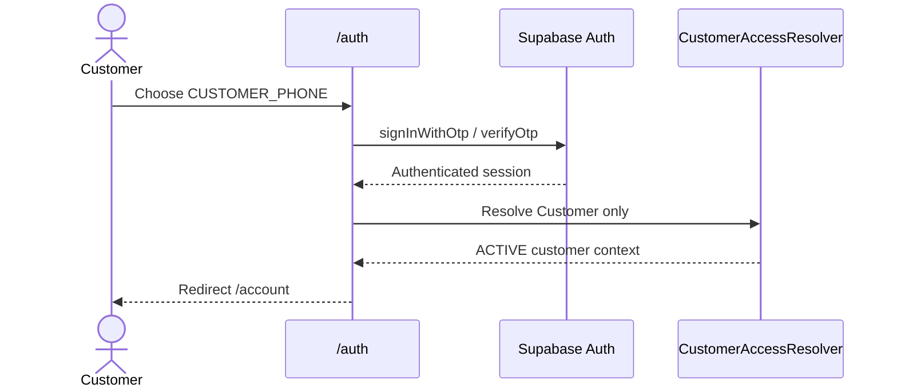
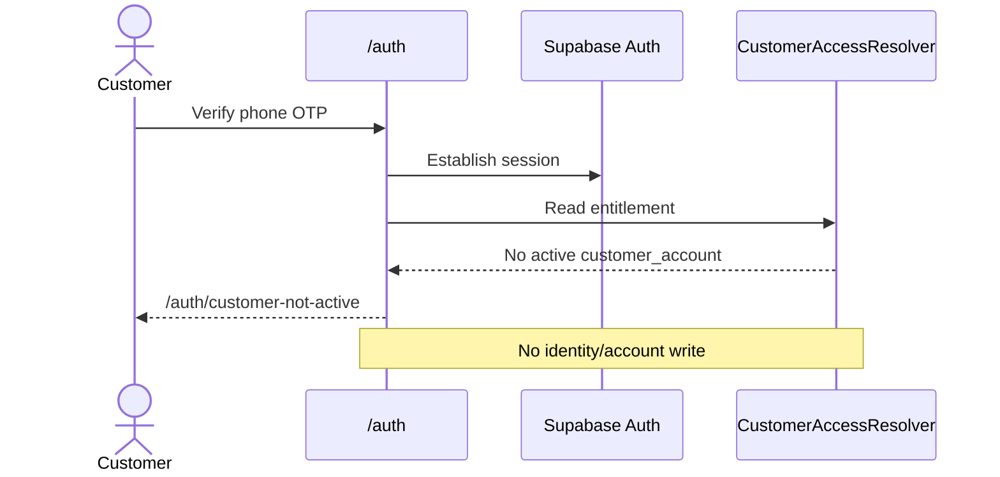
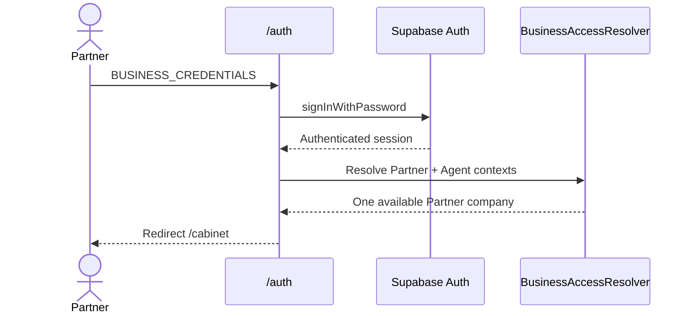
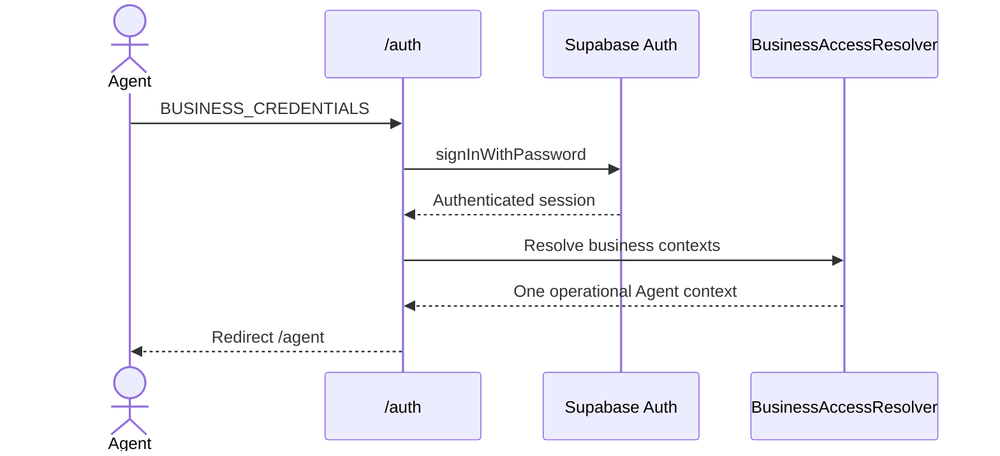
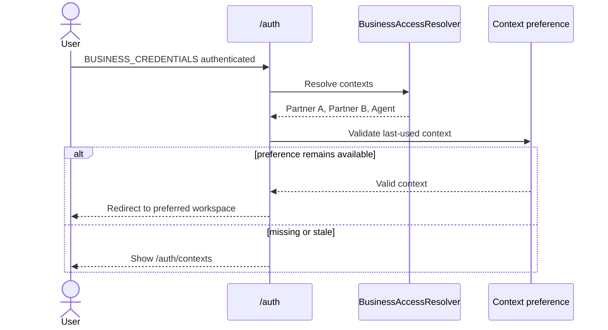

# Unified Auth and Access Contexts

Status: proposed architecture; owner implementation approval required. This document records the repository state at `origin/main` `d1fec704fac37067984e089a72ec083ad046829a`. It does not change runtime behavior.

## Owner-approved doctrine

- `/auth` is the single public authentication center.
- `CUSTOMER_PHONE` means phone plus SMS OTP and resolves only Customer access.
- `BUSINESS_CREDENTIALS` means email plus password and resolves Partner and Commercial Agent access.
- Login intent selects a resolver; it never grants an entitlement or permission.
- One `auth.users` row may own a Customer context, several Partner-company contexts, and an Agent context.
- Route guards and RLS revalidate governed server-side relationships. A browser-selected context is never authorization evidence.
- Internal/Admin authentication remains a separate, non-advertised staff flow in the first implementation. It must not be merged into the public resolver.
- No login path calls 1C. Portal owns access contexts; 1C remains commercial truth.

## Current implementation evidence

| Area | Current behavior | Evidence |
| --- | --- | --- |
| Public entry points | Business credentials live at `/auth/sign-in`; Partner registration and invitations have separate `/auth` routes. Customer OTP lives at `/account/sign-in`. There is no public `/auth` chooser. | `app/auth/sign-in/page.tsx`, `app/auth/register/page.tsx`, `app/auth/invitations`, `app/account/sign-in/page.tsx` |
| Business password | `signInWithPassword` is used. Unless an invitation or explicit `next` is present, the action redirects to `/cabinet`. | `src/modules/auth/actions/auth.actions.ts:15-65` |
| Customer phone | `signInWithOtp` uses `shouldCreateUser: true`; `verifyOtp` creates an authenticated Supabase session. The UI then routes to `/account`. | `src/modules/final-customer-auth/phone-otp.client.ts:20-39`, `src/modules/final-customer-auth/components/PhoneOtpForm.tsx` |
| Customer route guard | The private layout calls `getFinalCustomerContext()`. That function calls `ensureAccount()`, so a read/guard can create identity and account state. | `app/account/(private)/layout.tsx:11-18`, `src/modules/final-customer/server.ts:18-30`, `src/modules/final-customer/service.ts:39-58` |
| Partner context | The workspace service reads profile and memberships, then selects the first active membership (or first row). `user_profiles.user_type` also controls staff routing. | `src/modules/partner-cabinet/services/workspace-context.service.ts:89-177` |
| Agent context | Agent access resolves `commercial_agents.user_id = auth.uid()`. `ACTIVE` is operational; other lifecycle states are status-only or restricted. | `app/(agent)/agent/layout.tsx:14-22`, `supabase/migrations/20260913144354_agent_cabinet_ui_v1.sql:21-62` |
| Callback | The general callback only accepts a governed company-invitation path and then routes to `/cabinet`. | `app/auth/callback/route.ts:6-28` |
| SSR session | Server checks use `auth.getUser()`. The shared cookie client supports writes, but `proxy.ts` currently performs host/crawler/locale work only and does not refresh Supabase cookies. | `src/lib/supabase/server.ts:10-50`, `proxy.ts:7-36` |
| Customer RLS | Own-account reads require `auth.uid() = customer_accounts.auth_user_id`; writes remain server-governed. | `supabase/migrations/20260913194046_final_customer_auth_identity_foundation_v1.sql:149-169` |
| Partner RLS | Membership and downstream access are derived from the authenticated user, active membership, company relationship, role and permission functions. | `supabase/migrations/20260708210257_access_control_foundation.sql` and later access-control migrations |
| Agent RLS | Cabinet RPCs derive the current agent from `auth.uid()` rather than a supplied agent ID. | `supabase/migrations/20260913144354_agent_cabinet_ui_v1.sql:21-30,145,190` |

The schema can already represent a single user related independently to `customer_accounts`, `company_memberships[]`, and `commercial_agents`. The runtime cannot yet resolve or select those relationships as one access-context set. The single `user_type` classifier and the default-first Partner membership are routing limitations, not acceptable authorization truth for the target.

## Target authentication flow

### Public route contract

`/auth` renders two explicit choices:

1. Customer: phone + OTP (`CUSTOMER_PHONE`).
2. Business: email + password (`BUSINESS_CREDENTIALS`).

The current `/account/sign-in` and `/auth/sign-in` remain compatibility aliases during rollout. They start the matching intent and retain validated `next` behavior only when the destination is valid for the resolved context. Invitation and internal activation URLs remain separate governed flows.

### Login intent

Intent is transient server-owned flow state, not user metadata or an authorization claim.

- A server action starts the flow and writes a short-lived, `HttpOnly`, `Secure`, `SameSite=Lax` cookie containing a nonce, intent, issued/expiry time, and safe return reference. It is authenticated or encrypted with a rotating server secret.
- OAuth/confirmation callbacks carry only an opaque, single-use state reference when a callback is needed.
- The state is consumed after successful authentication. Expired, replayed, malformed, or mismatched state falls back to `/auth`; it never broadens resolver scope.
- A query parameter may select which form is displayed, but the server-signed state controls the resolver.
- Supabase Auth session data is not rewritten with roles or context IDs.

The intent prevents a Customer login from accidentally landing in Partner or Agent. It does not prevent an already authenticated user from later choosing another legitimately available context through a governed switch action.

## AccessContext contract

Conceptual server DTO:

```ts
type LoginIntent = "CUSTOMER_PHONE" | "BUSINESS_CREDENTIALS";
type AccessAvailability = "AVAILABLE" | "PENDING" | "BLOCKED";

type AccessContext =
  | {
      type: "CUSTOMER";
      contextId: string; // customer_identity_id
      accountId: string;
      status: AccessAvailability;
      domainStatus: string;
      targetRoute: "/account";
    }
  | {
      type: "PARTNER";
      contextId: string; // company_id
      membershipId: string;
      status: AccessAvailability;
      domainStatus: string;
      targetRoute: "/cabinet";
    }
  | {
      type: "AGENT";
      contextId: string; // commercial_agent.id
      status: AccessAvailability;
      domainStatus: string;
      targetRoute: "/agent";
    };

type AccessResolution = {
  authenticatedUserId: string;
  loginIntent: LoginIntent;
  contexts: AccessContext[];
};
```

`status` is a routing family only. Exact Partner membership/company, Agent lifecycle, and Customer account statuses remain owned by their domains. The resolver does not flatten domain rules into a new role system.

### CustomerAccessResolver

- Accepts only an authenticated user from a verified phone flow.
- Reads `customer_accounts` by unique `auth_user_id` and returns Customer only when the account is an existing, purchase-entitled record.
- `ACTIVE` maps to `AVAILABLE`; review, suspended, or invalid links map to governed non-available states.
- Does not create `customer_identity`, `customer_account`, or any link.
- No Customer context routes to `/auth/customer-not-active` with a catalog CTA and an optional Business-login link.

### BusinessAccessResolver

- Accepts an authenticated Supabase user after password login.
- Returns all Partner company memberships and the Agent relationship in one bounded server read/RPC.
- A Partner context is available only when membership, company and approved-access state are valid. Commercial data is loaded after selection, not for every candidate.
- An Agent context is available only when the Agent domain marks it operational. Pending/suspended states remain visible only as governed status destinations where appropriate.
- `user_profiles.user_type` may remain compatibility metadata but does not exclude other legitimate relationships.

### Deterministic routing

| Intent | Resolution | Route |
| --- | --- | --- |
| `CUSTOMER_PHONE` | one active Customer context | `/account` |
| `CUSTOMER_PHONE` | no active Customer context | `/auth/customer-not-active` |
| `BUSINESS_CREDENTIALS` | zero available contexts | one governed business access-state page; never `/account` |
| `BUSINESS_CREDENTIALS` | one available context | its `targetRoute` |
| `BUSINESS_CREDENTIALS` | two or more available contexts, valid preference | preferred context route |
| `BUSINESS_CREDENTIALS` | two or more, no valid preference | `/auth/contexts` |

Pending and blocked contexts never count as available. Direct URL entry reruns the corresponding route guard and cannot rely on the login redirect.

## Context selection and last-used context

Recommendation: show Customer in the authenticated switcher only when an active Customer entitlement exists, but require an explicit switch action. The initial `BUSINESS_CREDENTIALS` redirect considers only Partner/Agent. This preserves login intent while avoiding duplicate accounts and allowing one person to reach every legitimate surface after authentication.

Use an additive `user_access_preferences` table:

| Column | Purpose |
| --- | --- |
| `auth_user_id` primary key/FK | Preference owner |
| `last_business_context_type` | `PARTNER` or `AGENT`; never a permission |
| `last_business_context_id` | Company or Agent identifier |
| `updated_at` | Audit/staleness support |

A server switch action receives `{type, contextId}`, reloads the caller's contexts, rejects any unavailable target, then updates the preference and redirects. Every use revalidates the relationship. Revocation makes a preference inert immediately. A short-lived display cookie may reduce UI flicker, but it is never read by RLS or treated as membership.

Partner requests that operate within a company continue to pass a company identifier into server orchestration, which validates it against an active membership. The resolver must not globally mutate the user's memberships or commercial state when switching.

## Route guards

| Route | Required guard | Failure behavior |
| --- | --- | --- |
| `/account` | authenticated user plus purchase-entitled `ACTIVE` `customer_account` | unauthenticated to `/auth?intent=customer`; authenticated/no entitlement to `/auth/customer-not-active`; non-active to governed state |
| `/cabinet` | selected Partner context with active membership and company access | unauthenticated to Business auth; stale selection re-resolves; pending/suspended state shown without workspace access |
| `/agent` | Agent relation plus operational Agent state | unauthenticated to Business auth; pending/suspended status gate; absent relation denied |
| `/auth` | public | authenticated users may still select a valid intent; no context is inferred from the session alone |
| `/admin` | existing internal permission model | unchanged and outside public resolver |

## Sequence diagrams

### A. Returning Final Customer



### B. Phone login with no purchase



### D. Partner login



### E. Agent login



### F. Partner plus Agent



The first-purchase and 1C-outage sequences are in `FINAL_CUSTOMER_PROVISIONING.md`.

## Security design

### Authentication and enumeration

- Before OTP verification, use one generic response for existing and unknown phones. `shouldCreateUser` may create an Auth identity, but not a Portal entitlement.
- The current Send SMS Hook verifies a Standard Webhooks signature and payload, enforces a 64 KiB body limit, hashes the phone for a five-per-ten-minute Portal bucket, and supports provider idempotency. Supabase/provider limits and CAPTCHA remain defense in depth (`app/api/auth/hooks/send-sms/route.ts`, `src/modules/final-customer-auth/auth-sms.service.ts`).
- Business login retains the generic “email or password is incorrect” response. Supabase/password/provider rate limits remain enabled; no account-existence disclosure is added.
- OTP, passwords, access tokens, raw phones/emails, signed state, and session cookies are never logged.

### Intent, redirects and session safety

- Intent state is signed, expiring, single-use, and cleared after resolution. Successful authentication replaces any pre-auth context cookie to prevent fixation.
- Continue `safeNextPath` validation, then additionally require the destination to belong to the resolved context type.
- Add Supabase's recommended server session-refresh integration to the Next.js proxy as a bounded operational improvement. Authorization must continue to validate server-side user/session evidence; never trust a browser `getSession()` payload.
- Logout clears intent and display-context cookies as well as the Supabase session.

### Context and data isolation

- Forged `contextId` is rejected by a fresh relationship lookup.
- Customer reads remain `auth.uid() -> customer_accounts -> customer_identity_id` and never accept a customer ID as ownership proof.
- Partner reads remain `auth.uid() -> active company_membership -> company` plus permissions.
- Agent reads remain `auth.uid() -> commercial_agents.user_id` plus lifecycle/compliance state.
- Context switching changes preference only; it cannot grant roles, permissions, membership, commercial profile, or historical data.
- Phone ownership alone never exposes historical 1C data or merges identities.

## RLS impact

No weakening is required. New tables/RPCs must use RLS, FORCE RLS where the adjacent domain does, least grants, and fixed `search_path` for privileged functions.

- `user_access_preferences`: own-row read/update or server-only mutation; no context permission is derived from it.
- Access resolver RPC: authenticated execution, returns only contexts related to `auth.uid()`, never accepts a user ID.
- Existing Customer, Partner and Agent domain policies continue to enforce their relationships independently.
- The selected context may scope queries, but RLS must prove the caller-to-context relationship again.

## Performance contract

The auth resolver is server-side and bounded:

- Authentication validation: one Supabase Auth validation.
- Customer intent: one indexed lookup on unique `customer_accounts.auth_user_id`; no 1C and no writes.
- Business intent: one RPC/read shape that returns memberships/companies and at most one Agent relationship. Target fanout is one database request after auth, not one request per company.
- Preference validation is folded into the business resolver or fetched in the same RPC.
- Partner permissions and commercial context are loaded only for the selected company. Do not compute permission sets for every selector item.
- Request-local memoization avoids duplicate layout/page resolution.

Expected login fanout is one Auth request plus one resolver database request; selecting a Partner may add one existing permission/commercial-context read. No N+1, browser role fanout, live 1C, polling, or new cron is permitted.

## Safe observability

Emit bounded lifecycle events, not per-row logs:

| Event | Safe fields |
| --- | --- |
| `AUTHENTICATED` | correlation ID, intent, auth method, duration, outcome |
| `CUSTOMER_CONTEXT_FOUND` | pseudonymous user ID, context status, duration |
| `CUSTOMER_CONTEXT_NOT_ACTIVE` | pseudonymous user ID, reason code, duration |
| `BUSINESS_CONTEXT_RESOLVED` | counts by type/status, selected type, duration |
| `MULTIPLE_CONTEXTS` | Partner count, Agent count, preference-valid flag |
| `CONTEXT_DENIED` | requested type, reason code, route; no supplied raw ID in INFO logs |

ERROR is retained for failures, WARN only for meaningful degradation, INFO for aggregate lifecycle outcomes, and DEBUG disabled by default. Never record phone, email, password, OTP, token, cookie, signed intent, or provider response body.

## Gap matrix

| Area | Current implementation | Target implementation | Gap | Risk | Change required | Migration impact | Priority |
| --- | --- | --- | --- | --- | --- | --- | --- |
| Auth entry point | Separate `/auth/sign-in` and `/account/sign-in` | One `/auth` chooser | Fragmented intent/UX | Wrong destination | Add shell and aliases | None initially | P0 |
| Login methods | Password and OTP already exist | Same methods behind explicit intents | No shared orchestration | Scope confusion | Intent flow service | None | P0 |
| Login intent | `next` and route imply intent | Signed transient enum | Browser path is implicit | Cross-surface misroute | Signed state + consume action | None | P0 |
| Final Customer creation | `/account` guard calls `ensureAccount()` | Read-only resolver; purchase-triggered creation | Core invariant violated | Empty/unauthorized cabinets | Remove write from guard behind flag | Account schema/event additions | P0 |
| `customer_identity` | Created by context triggers and OTP resolver | May pre-exist; deterministically resolved at purchase | Bare/duplicate roots possible | Wrong correlation | Transactional resolution/reconciliation | Add binding/evidence constraints | P0 |
| `customer_account` | Created after verified OTP | Created/reused only after confirmed purchase | Entitlement too early | Access without purchase | Provisioning service/RPC | Add purchase entitlement evidence | P0 |
| Partner resolver | Picks first active membership | Returns all company contexts | No multi-company selection | Non-deterministic workspace | Bounded business resolver | Preference table/RPC | P1 |
| Agent resolver | Direct route resolves current agent | Included in business contexts | Login defaults to Partner | Agent-only wrong route | Include Agent state | Resolver RPC only | P1 |
| Context switch | None | Governed switcher | Cannot use dual roles | Duplicate accounts/workarounds | Switch action + selector | Preference table | P1 |
| Route guards | Domain-specific but Customer guard mutates | Read-only, direct-entry-safe guards | Inconsistent semantics | Unauthorized or surprise writes | Replace guard contracts | None/additive views | P0 |
| RLS | Relationship-based | Same relationship-based model | Selected context not standardized | Forged context | New RPC/table policies only | Additive | P0 |
| Retail first-purchase trigger | Payment activates order only | Provider-neutral `FIRST_PURCHASE_CONFIRMED` | No provisioning event | Provider coupling if improvised | Durable event at activation boundary | Outbox/idempotency tables | P0 |
| 1C provisioning | External-ref seam exists; no purchase worker | Async match/create | No workflow/state | ERP outage could block if inline | Retryable async service | Job/status records | P1 |
| Existing customers | Old OTP-created accounts exist | Classify, grandfather, review | Unknown purchase provenance | Accidental lockout | Read-only classification first | Add classification/provenance | P1 |
| Tests | Encode OTP provisioning and direct redirects | Resolver/provisioning/context matrix | Old expectation conflicts | Regression | Replace/add focused suites | Test fixtures only | P0 |
| RU/RO | Separate pages have localized copy | Unified shell, selector, inactive page parity | New copy absent | Broken localized path | Add both locales together | None | P1 |
| Observability | SMS and domain diagnostics exist | Intent/resolution/provision lifecycle | Missing cross-flow evidence | Slow incident diagnosis | Safe aggregate events | Optional event/outbox columns | P1 |
| Session refresh | Cookie client exists; proxy does not refresh auth | Recommended SSR refresh flow | Long-lived session edge cases | Sporadic auth loss | Bounded proxy integration | None | P1 |
| Low-risk cleanup | `user_type` drives early routing; old paths remain canonical | Compatibility-only classifier and aliases | Legacy coupling | Future drift | Deprecate only after cutover | None | P2 |

## Implementation slices and rollback

| Slice | Bounded change | Feature gate / rollback | Production acceptance |
| --- | --- | --- | --- |
| 1. Access read model | Add AccessContext DTO, resolver RPC/service, metrics, read-only legacy classification | `UNIFIED_ACCESS_RESOLVER=false` keeps all old routing; additive migration can remain unused | Compare resolver output with current Partner/Agent/Customer states; cross-tenant tests |
| 2. Unified Auth shell | Add `/auth`, signed intent, customer-not-active and context-selection shells; retain old URLs as aliases | `UNIFIED_AUTH_CENTER`; disable to restore old entry pages | RU/RO, redirect safety, password and OTP success/failure, no entitlement writes |
| 3. Business routing | Use Business resolver after password auth; support Agent and multiple companies; add preference | `BUSINESS_CONTEXT_ROUTING`; fallback to `/cabinet` behavior | Partner-only, Agent-only, dual-role, multi-company, pending/suspended, stale preference |
| 4. Purchase evidence foundation | Add verified checkout binding, provisioning idempotency/outbox schema; dark-write only | `CUSTOMER_PURCHASE_BINDING`; rollback consumer, preserve evidence | Guest/auth checkout compatibility, no order/MAIB change, RLS/grants/idempotency |
| 5. Post-purchase provisioning | Invoke provider-neutral provisioning after paid-order activation; dual-observe before enforcing | `POST_PURCHASE_CUSTOMER_PROVISIONING`; disable consumer; last-good account data remains | First purchase, duplicates/concurrency, non-MAIB fixture, 1C outage, account available |
| 6. Customer resolver cutover | Make Customer guard read-only; new no-purchase users go inactive page | `CUSTOMER_ACCOUNT_PURCHASE_GATE`; rollback to legacy resolver temporarily | OTP existing account, OTP no purchase, direct `/account`, RU/RO, zero writes |
| 7. Async 1C and legacy reconciliation | Enable retry worker; classify legacy records; review exceptions; later retire `ensureAccount` creation path | Independent worker flag and legacy grandfather flag | NEW/MATCHED/AMBIGUOUS/CONFLICT, outage/retry, no history leakage, operator diagnostics |

No big-bang cutover is acceptable. Schema is additive first. Old routes remain until telemetry and real-user acceptance pass. Rollback disables the consuming feature gate; it does not delete evidence, accounts, identities, preferences, or events.

## Test and acceptance plan

Automated coverage:

- Customer: returning account; OTP/no purchase; confirmed first purchase; unpaid/abandoned order; duplicate and concurrent confirmation; provisioning retry; 1C outage.
- Business: Partner only; Agent only; both; several Partner companies; pending/suspended/revoked states; missing profile; stale preference.
- Security: forged intent/context; replayed intent; open redirect; direct route entry; cross-company, cross-customer and cross-Agent access; phone enumeration; OTP throttling.
- Data: RLS/grants; resolver uses `auth.uid()`; idempotency constraints; no account write during resolver; no historical 1C disclosure.
- Compatibility: invitations, Partner onboarding, Agent status gate, Customer Service, retail checkout, MAIB callback/activation, Admin/internal login.

Runtime acceptance for implementation slices must use legitimate roles and RU/RO at 390, 768 and 1440 where UI changes. Capture request count and resolver latency; prove no live 1C call and no page-load fanout. Migrations require clean forward application, policy/grant verification and rollback-gate proof.

## Architecture change request

| Field | Decision |
| --- | --- |
| NEED | Prevent OTP from granting a cabinet and support one user with multiple governed contexts. |
| CURRENT LIMITATION | Customer route guards mutate state; password login defaults to Partner; no unified intent, resolver or switcher. |
| TARGET CHANGE | Signed login intent, bounded Customer/Business resolvers, logical AccessContext set, governed selector/preference, read-only route guards. |
| SCHEMA IMPACT | Add resolver/preference structures plus purchase/provisioning evidence described in the companion document; no second auth database. |
| RUNTIME IMPACT | `/auth` orchestration and route guards change incrementally; domain services remain owners. |
| SECURITY IMPACT | Stronger entitlement boundary; RLS remains relationship-based; explicit anti-forgery/replay controls. |
| MIGRATION IMPACT | Additive migrations, dark reads/writes, legacy classification, no automatic deletion or downgrade. |
| ROLLBACK | Per-slice feature flags restore prior routing while retaining compatible evidence. |
| RECOMMENDED IMPLEMENTATION ORDER | Resolver read model → Auth shell → business routing → purchase evidence → provisioning → Customer gate → async 1C/legacy review. |

`ARCHITECTURE_CHANGE_REQUEST=YES`. Runtime implementation must not begin until the owner approves this bounded proposal.
